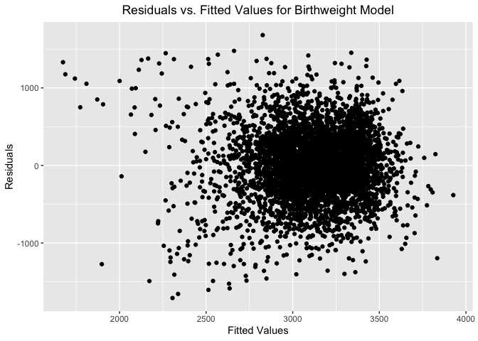
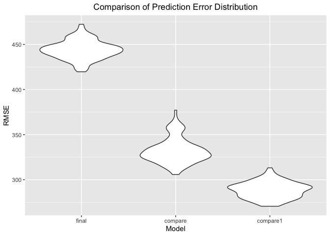

Homework \#6
================
Sophia Miller
11/21/2019

``` r
library(tidyverse)
```

    ## ── Attaching packages ────────────────────────────────────────────────── tidyverse 1.2.1 ──

    ## ✔ ggplot2 3.2.1     ✔ purrr   0.3.2
    ## ✔ tibble  2.1.3     ✔ dplyr   0.8.3
    ## ✔ tidyr   1.0.0     ✔ stringr 1.4.0
    ## ✔ readr   1.3.1     ✔ forcats 0.4.0

    ## ── Conflicts ───────────────────────────────────────────────────── tidyverse_conflicts() ──
    ## ✖ dplyr::filter() masks stats::filter()
    ## ✖ dplyr::lag()    masks stats::lag()

``` r
library(modelr)
library(mgcv)
```

    ## Loading required package: nlme

    ## 
    ## Attaching package: 'nlme'

    ## The following object is masked from 'package:dplyr':
    ## 
    ##     collapse

    ## This is mgcv 1.8-28. For overview type 'help("mgcv-package")'.

``` r
set.seed(1)
```

# Problem 1

Importing and tidying the birthweight dataset:

``` r
#check missing values
birthweight_data = read_csv(file = "./data/birthweight.csv") %>% 
  janitor::clean_names() %>% 
  mutate(
    babysex = as.factor(babysex),
    frace = as.factor(frace),
    malform = as.factor(malform),
    mrace = as.factor(mrace),
  ) %>% 
  mutate(
    babysex = fct_infreq(babysex),
    frace = fct_infreq(frace),
    malform = fct_infreq(malform),
    mrace = fct_infreq(mrace))
```

    ## Parsed with column specification:
    ## cols(
    ##   .default = col_double()
    ## )

    ## See spec(...) for full column specifications.

Test variables in separate models individually to assess significance:

``` r
fit_fincome = lm(bwt ~ fincome, data = birthweight_data) 

fit_gaweeks = lm(bwt ~ gaweeks, data = birthweight_data)

fit_malform = lm(bwt ~ malform, data = birthweight_data)

fit_menarche = lm(bwt ~ menarche, data = birthweight_data)

fit_momage = lm(bwt ~ momage, data = birthweight_data)

fit_mrace = lm(bwt ~ mrace, data = birthweight_data)

fit_ppbmi = lm(bwt ~ ppbmi, data = birthweight_data)

fit_smoken = lm(bwt ~ smoken, data = birthweight_data) 

fit_fincome %>%
  broom::tidy()
```

    ## # A tibble: 2 x 5
    ##   term        estimate std.error statistic  p.value
    ##   <chr>          <dbl>     <dbl>     <dbl>    <dbl>
    ## 1 (Intercept)  2980.      15.1       197.  0.      
    ## 2 fincome         3.05     0.296      10.3 1.26e-24

``` r
fit_gaweeks %>%
  broom::tidy()
```

    ## # A tibble: 2 x 5
    ##   term        estimate std.error statistic   p.value
    ##   <chr>          <dbl>     <dbl>     <dbl>     <dbl>
    ## 1 (Intercept)    476.      88.8       5.36 8.76e-  8
    ## 2 gaweeks         66.9      2.25     29.8  9.69e-178

``` r
fit_malform %>%
  broom::tidy()
```

    ## # A tibble: 2 x 5
    ##   term        estimate std.error statistic p.value
    ##   <chr>          <dbl>     <dbl>     <dbl>   <dbl>
    ## 1 (Intercept)   3114.       7.79  400.       0    
    ## 2 malform1        11.6    132.      0.0878   0.930

``` r
fit_menarche %>%
  broom::tidy()
```

    ## # A tibble: 2 x 5
    ##   term        estimate std.error statistic p.value
    ##   <chr>          <dbl>     <dbl>     <dbl>   <dbl>
    ## 1 (Intercept)  3220.       66.3      48.6    0    
    ## 2 menarche       -8.47      5.26     -1.61   0.108

``` r
fit_momage %>%
  broom::tidy()
```

    ## # A tibble: 2 x 5
    ##   term        estimate std.error statistic  p.value
    ##   <chr>          <dbl>     <dbl>     <dbl>    <dbl>
    ## 1 (Intercept)   2750.      41.0      67.0  0.      
    ## 2 momage          17.9      1.99      9.03 2.57e-19

``` r
fit_mrace %>%
  broom::tidy()
```

    ## # A tibble: 4 x 5
    ##   term        estimate std.error statistic  p.value
    ##   <chr>          <dbl>     <dbl>     <dbl>    <dbl>
    ## 1 (Intercept)    3267.      10.5    310.   0.      
    ## 2 mrace2         -317.      15.4    -20.6  6.25e-90
    ## 3 mrace4         -211.      33.1     -6.39 1.86e-10
    ## 4 mrace3         -126.      75.3     -1.68 9.32e- 2

``` r
fit_ppbmi %>%
  broom::tidy()
```

    ## # A tibble: 2 x 5
    ##   term        estimate std.error statistic  p.value
    ##   <chr>          <dbl>     <dbl>     <dbl>    <dbl>
    ## 1 (Intercept)   2788.      53.0      52.6  0.      
    ## 2 ppbmi           15.1      2.43      6.22 5.56e-10

``` r
fit_smoken %>%
  broom::tidy()
```

    ## # A tibble: 2 x 5
    ##   term        estimate std.error statistic     p.value
    ##   <chr>          <dbl>     <dbl>     <dbl>       <dbl>
    ## 1 (Intercept)  3136.        8.88    353.   0          
    ## 2 smoken         -5.23      1.05     -5.00 0.000000607

Multivariable model with variables that were significant:

``` r
#fincome, gaweeks, momage, mrace, ppbmi, smoken
fit_multi = lm(bwt ~ fincome + gaweeks + momage + mrace + ppbmi + smoken, data = birthweight_data) 

fit_multi %>% 
  broom::tidy()
```

    ## # A tibble: 9 x 5
    ##   term        estimate std.error statistic   p.value
    ##   <chr>          <dbl>     <dbl>     <dbl>     <dbl>
    ## 1 (Intercept)  608.      102.        5.96  2.69e-  9
    ## 2 fincome        0.475     0.289     1.64  1.00e-  1
    ## 3 gaweeks       58.9       2.17     27.1   9.96e-150
    ## 4 momage        -0.275     1.92     -0.143 8.86e-  1
    ## 5 mrace2      -284.       16.3     -17.4   6.82e- 66
    ## 6 mrace4      -193.       30.7      -6.27  3.85e- 10
    ## 7 mrace3      -128.       69.2      -1.85  6.39e-  2
    ## 8 ppbmi         16.3       2.14      7.61  3.23e- 14
    ## 9 smoken       -11.0       0.938   -11.7   3.50e- 31

Take significant variables from multivariable model to make final model:

``` r
#gaweeks, mrace, ppbmi, smoken
fit_final = lm(bwt ~ gaweeks + mrace + ppbmi + smoken, data = birthweight_data)
fit_final %>% 
  broom::tidy()
```

    ## # A tibble: 7 x 5
    ##   term        estimate std.error statistic   p.value
    ##   <chr>          <dbl>     <dbl>     <dbl>     <dbl>
    ## 1 (Intercept)    624.     97.0        6.43 1.38e- 10
    ## 2 gaweeks         59.0     2.17      27.2  1.18e-150
    ## 3 mrace2        -293.     14.6      -20.0  1.83e- 85
    ## 4 mrace4        -201.     30.2       -6.66 2.98e- 11
    ## 5 mrace3        -134.     68.6       -1.96 4.99e-  2
    ## 6 ppbmi           16.3     2.13       7.66 2.32e- 14
    ## 7 smoken         -11.0     0.938    -11.8  2.10e- 31

Plot of residuals against fitted values:

``` r
birthweight_res = modelr::add_residuals(birthweight_data, fit_final) 

birthweight_res_pred = modelr::add_predictions(birthweight_res, fit_final)

ggplot(birthweight_res_pred, aes(x = pred, y = resid)) + geom_point() +
  labs(
    title = "Residuals vs. Fitted Values for Birthweight Model",
    x = "Fitted Values",
    y = "Residuals"
  ) +
  theme(plot.title = element_text(hjust = 0.5))
```

<!-- -->

Make comparison models:

``` r
fit_compare = lm(bwt ~ blength + gaweeks, data = birthweight_data)

fit_compare1 = lm(bwt ~ bhead + blength + babysex, data = birthweight_data)
```

Cross validation:

``` r
cv_df = 
  crossv_mc(birthweight_data, 100) %>% 
  mutate(
    fit_final = map(train, ~lm(bwt ~ gaweeks + mrace + ppbmi + smoken, data = .x)),
    fit_compare = map(train, ~lm(bwt ~ blength + gaweeks, data = .x)),
    fit_compare1 = map(train, ~lm(bwt ~ bhead + blength + babysex, data = .x))
    ) %>% 
  mutate(
    rmse_final = map2_dbl(fit_final, test, ~rmse(model = .x, data = .y)),
    rmse_compare = map2_dbl(fit_compare, test, ~rmse(model = .x, data = .y)),
    rmse_compare1 = map2_dbl(fit_compare1, test, ~rmse(model = .x, data = .y))
    )
```

Plot prediction error distribution:

``` r
cv_df %>% 
  select(starts_with("rmse")) %>%
  pivot_longer(
    everything(),
      names_to = "model",
      values_to = "rmse",
      names_prefix = "rmse_") %>% 
  mutate(model = fct_inorder(model)) %>% 
  ggplot(aes(x = model, y = rmse)) + geom_violin() +
    labs(
    title = "Comparison of Prediction Error Distribution",
    x = "Model",
    y = "RMSE"
  ) +
  theme(plot.title = element_text(hjust = 0.5))
```

<!-- -->

# Problem 2

Load data:

``` r
weather_df = 
  rnoaa::meteo_pull_monitors(
    c("USW00094728"),
    var = c("PRCP", "TMIN", "TMAX"), 
    date_min = "2017-01-01",
    date_max = "2017-12-31") %>%
  mutate(
    name = recode(id, USW00094728 = "CentralPark_NY"),
    tmin = tmin / 10,
    tmax = tmax / 10) %>%
  select(name, id, everything())
```

    ## Registered S3 method overwritten by 'crul':
    ##   method                 from
    ##   as.character.form_file httr

    ## Registered S3 method overwritten by 'hoardr':
    ##   method           from
    ##   print.cache_info httr

    ## file path:          /Users/sophiamiller/Library/Caches/rnoaa/ghcnd/USW00094728.dly

    ## file last updated:  2019-10-01 10:17:13

    ## file min/max dates: 1869-01-01 / 2019-09-30
